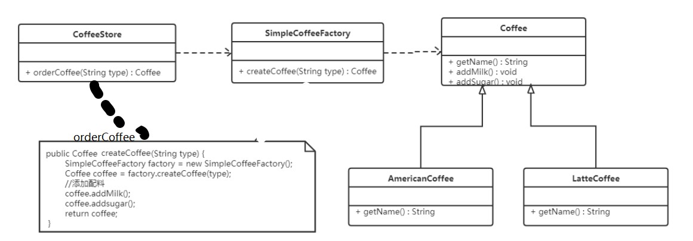
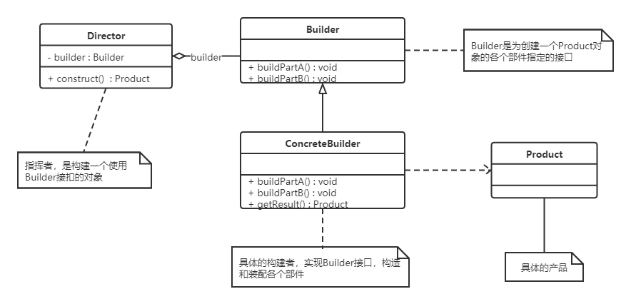

# 4，创建型模式

## 4.1 单例模式
- 概述

所谓类的单例设计模式，就是采取一定的方法保证在整个的软件系统中，对某个类只能存在 `一个对象实例`，并且该类`只提供一个取得其对象实例的方法`（静态方法）

- 八种方式
  - 饿汉式（静态常量）
  - 饿汉式（静态代码块）
  - 懒汉式（线程不安全）
  - 懒汉式（线程安全，同步方法）
  - 懒汉式（线程不安全，同步代码块）
  - 双重检查
  - 静态内部类
  - 枚举

### 1.饿汉式（静态常量）

- 概述
  1. 构造器私有化（防止外部 new）
  2. 类的内部创建对象
  3. 向外暴露一个静态的公共方法 `getInstance`
- 代码

```java
public class Singleton(){
    private Singleton(){}
    private static final Singleton instance = new Singleton();
    
    public static Singleton getInstance(){
        return instance;
    }
}
```

- 优缺点
  - 优点：这种写法比较简单，就是在类装载的时候就完成实例化。避免了线程同步问题
  - 缺点：在类装载的时候就完成实例化，`没有达到 Lazy Loading` 的效果。如果从始至终从未使用过这个实例，则会造成内存的浪费
  - 这种方式基于 classloader 机制避免了多线程的同步问题。不过，instance 在类装载时就实例化，在单例模式中大多数都是调用`getlnstance` 方法，但是导致类装载的原因有很多种，因此不能确定有其他的方式（或者其他的静态方法）导致类装载，这时候初始化 instance 就没有达到 Lazy loading 的效果
  - 结论：这种单例模式可用，可能造成`内存浪费`

### 2.饿汉式（静态代码块）

- 概述
  1. 构造器私有化
  2. 类的内部声明对象
  3. 在静态代码块中创建对象
  4. 向外暴露一个静态的公共方法
- 代码

```java
public class Singleton{
    // 1、构造器私有化
    private Singleton(){}
    
    // 2、类的内部声明对象
    private static Singletion instance;
    
    // 3、在静态代码块中创建对象
    static {
        instance = new Singleton();
    }
    
    // 4、向外暴露一个静态的公共方法
    public static Singleton getInstance(){
        return instance;
    }
}
```


- 优缺点
  - 这种方式和上面的方式其实类似，只不过将类实例化的过程放在了静态代码块中，也是在类装载的时候，就执行静态代码块中的代码，初始化类的实例。优缺点和上面是一样的。
  - 结论：这种单例模式可用，但是可能造成内存浪费

### 3.懒汉式（线程不安全）

- 概述
  1. 构造器私有化
  2. 类的内部声明对象
  3. 向外暴露一个静态的公共方法，当使用到该方法时，才去创建 instance
- 代码

```java
public class Singleton{
    // 1、构造器私有化
    private Singleton(){}
    
    // 2、类的内部声明对象
    private static Singletion instance;
    
    // 3. 向外暴露一个静态的公共方法，当使用到该方法时，才去创建 instance
    public static Singleton getInstance(){
        if(instance == null){
            instance = new Singletion();
        }
        return instance;
    }
}
```


- 优缺点
  - 起到了 Lazy Loading 的效果，但是只能在`单线程`下使用
  - 如果在多线程下，一个线程进入了判断语句块，还未来得及往下执行，另一个线程也通过了这个判断语句，这时便会`产生多个实例`
  - 结论：在实际开发中，不要使用这种方式

### 4.懒汉式（线程安全，同步方法）

- 概述
  1. 构造器私有化
  2. 类的内部声明对象
  3. 向外暴露一个静态的公共方法，加入同步处理的代码，解决线程安全问题
- 代码

```java
public class Singleton{
    // 1、构造器私有化
    private Singleton(){}
    
    // 2、类的内部声明对象
    private static Singletion instance;
    
    // 3. 向外暴露一个静态的公共方法，加入同步处理的代码，解决线程安全问题
    public static synchronized Singleton getInstance(){
        return instance;
    }
}
```

- 优缺点
  - `解决了线程不安全问题`
  - `效率太低`了，每个线程在想获得类的实例时候，执行`getlnstance()`方法都要进行同步。而其实这个方法只执行一次实例化代码就够了，后面的想获得该类实例，直接return就行了。后续仍需对方法进行同步效率太低。（粒度太大了）
  - 结论：在实际开发中，不推荐使用这种方式

### 5.懒汉式（线程不安全，同步代码块）

- 概述
  1. 构造器私有化
  2. 类的内部声明对象
  3. 向外暴露一个静态的公共方法，加入同步处理的代码块
- 代码

```java
public class Singleton{
    // 1、构造器私有化
    private Singleton(){}
    
    // 2、类的内部声明对象
    private static Singletion instance;
    
    // 3、向外暴露一个静态的公共方法，加入同步处理的代码块
    publiv static Singleton getInstance(){
        if(instance == null){
            synchronized (Singleton.class) {
                instance = new Singleton();
            }
        }
        return instance;
    }      
}
```


- 优缺点
  - 这种方式，本意是想对第四种实现方式的改进，因为前面同步方法效率太低，改为同步产生实例化的的代码块
  - 但是这种同步并不能起到线程同步的作用。跟第3种实现方式遇到的情形一致，假如一个线程进入了判断语句块，还未来得及往下执行，另一个线程也通过了这个判断语句，这时便会产生多个实例
  - 结论：在实际开发中，不能使用这种方式

### 6.双重检查（推荐）

- 概述
  1. 构造器私有化
  2. 类的内部创建对象，同时用volatile关键字修饰修饰
  3. 向外暴露一个静态的公共方法，加入同步处理的代码块，并进行双重判断，解决线程安全问题
- 代码

```java
public class Singleton{
    // 1、构造器私有化
    private Singleton(){}
    
    // 2、类的内部声明对象，同时用volatile关键字修饰修饰
    private static volatile Singletion instance;  
    
    //3.向外暴露一个静态的公共方法，加入同步处理的代码块，并进行双重判断，解决线程安全问题
    publiv static Singleton getInstance(){
        if(instance == null){
            synchronized (Singleton.class){
                if(instance == null){
                    instance = new Singleton();
                }
            }
        }
        return instance;
    }
}
```

volatile关键字：当多个线程同时访问同一个volatile变量时，它们会从`内存`中读取该变量的值，而不是从线程的`本地缓存`中读取。同样的，当`更新`一个volatile变量时，它会`立即写入到内存`中，而`不是延迟更新`。

确保了多个线程都加入了第一个判断，在第一个线程实例化后，其他线程不再从本地缓存中读取null的instance，而是实例化的instance，不再加入第二个判断。

- 优缺点
  - Double-Check 概念是多线程开发中常使用到的，我们进行了两次检查，这样就可以保证线程安全了
  - 这样实例化代码只用执行一次，后面再次访问时直接 return 实例化对象，也避免的反复进行方法同步
  - `线程安全；延迟加载；效率较高`
  - 结论：在实际开发中，推荐使用这种单例设计模式

### 7.静态内部类(推荐)

- 概述
  1. 构造器私有化
  2. 定义一个静态内部类，内部定义当前类的静态属性
  3. 向外暴露一个静态的公共方法
- 代码

```java
public class Singleton{
    // 1、构造器私有化
    private Singleton(){}
    
    // 2、定义一个静态内部类，内部定义当前类的静态属性
    private static class SingletonInstance(){
        private static final Singleton instance = new Singleton();
    }
    
    // 3、向外暴露一个静态的公共方法
    publiv static Singleton getInstance(){
        return SingletonInstance.instance;
    }
}
```

- 优缺点
  - 这种方式采用了类装载的机制，来保证初始化实例时只有一个线程
  - 静态内部类方式在 Singleton 类被装载时并不会立即实例化，而是在需要实例化时，调用`getlnstance`方法，才会装载Singletonlnstance 类，从而完成 Singleton 的实例化
  - 类的静态属性只会在第一次加载类的时候初始化，JVM帮助我们保证了线程的安全性，在类进行初始化时，别的线程是无法进入的
  - 优点：避免了线程不安全，利用静态内部类特点实现延迟加载，效率高
  - 结论：推荐使用

### 8.枚举

- 代码

```java
public enum Singleton {
    INSTANCE;

    public void sayHello() {
        System.out.println("Hello World");
    }
}
```

- 优缺点
  - 这借助 JDK1.5 中添加的枚举来实现单例模式。不仅能避免多线程同步问题，而且还能防止反序列化重新创建新的对象
  - 这种方式是 Effective Java 作者 Josh Bloch 提倡的方式
  - 结论：推荐使用

### JDK源码分析

JDK中 java.lang.Runtime 就是经典的单例模式


### 注意事项

● 单例模式保证了系统内存中该类`只存在一个对象`，`节省了系统资源`，对于一些需要`频繁创建销毁`的对象，使用单例模式可以`提高系统性能`
● 当想实例化一个单例类的时候，必须要记住使用相应的`获取对象的方法`，而不是使用 new
● 单例模式使用的场景：需要`频繁的进行创建和销毁的对象`、`创建对象时耗时过多或耗费资源过多但又经常用到的对象`（即：重量级对象）、`工具类对象`、`频繁访问数据库或文件的对象`（比如数据源、session 工厂等）	


## 4.2 工厂模式（具体工厂实现具体产品）

### 4.2.1 概述

需求：设计一个咖啡店点餐系统。  

设计一个咖啡类（Coffee），并定义其两个子类（美式咖啡【AmericanCoffee】和拿铁咖啡【LatteCoffee】）；再设计一个咖啡店类（CoffeeStore），咖啡店具有点咖啡的功能。

具体类的设计如下：


在java中，万物皆对象，这些对象都需要创建，如果创建的时候直接new该对象，就会对该对象耦合严重，假如我们要更换对象，所有new对象的地方都需要修改一遍，这显然违背了软件设计的开闭原则。如果我们使用工厂来生产对象，我们就只和工厂打交道就可以了，彻底和对象解耦，如果要更换对象，直接在工厂里更换该对象即可，达到了与对象解耦的目的；所以说，工厂模式最大的优点就是：**解耦**。

在本教程中会介绍三种工厂的使用

* 简单工厂模式（不属于GOF的23种经典设计模式）
* 工厂方法模式
* 抽象工厂模式


### 4.2.2 简单工厂模式

简单工厂不是一种设计模式，反而比较像是一种编程习惯。

#### 4.2.2.1 结构

简单工厂包含如下角色：

* 抽象产品 ：定义了产品的规范，描述了产品的主要特性和功能。Coffee
* 具体产品 ：实现或者继承抽象产品的子类 （美式咖啡、拿铁咖啡）
* 具体工厂 ：提供了创建产品的方法，调用者通过该方法来获取产品。

#### 4.2.2.2 实现

将对象创建过程转移到简单工厂中（创建对象的操作和业务代码解耦）

现在使用简单工厂对上面案例进行改进，类图如下：



工厂类代码如下：

```java
public class SimpleCoffeeFactory {

    public Coffee createCoffee(String type) {
        Coffee coffee = null;
        if("americano".equals(type)) {
            coffee = new AmericanoCoffee();
        } else if("latte".equals(type)) {
            coffee = new LatteCoffee();
        }
        return coffee;
    }
}
```

工厂（factory）处理创建对象的细节，一旦有了SimpleCoffeeFactory，CoffeeStore类中的orderCoffee()就变成此对象的客户，后期如果需要Coffee对象直接从工厂中获取即可。这样也就`解除了和Coffee实现类的耦合`，同时又产生了`新的耦合`，CoffeeStore对象和SimpleCoffeeFactory工厂对象的耦合，工厂对象和商品对象的耦合。

后期如果再加新品种的咖啡，我们势必要需求修改SimpleCoffeeFactory的代码，违反了开闭原则。工厂类的客户端可能有很多，比如创建美团外卖等，这样只需要修改工厂类的代码，省去其他的修改操作。

#### 4.2.2.4 优缺点

**优点：**

封装了创建对象的过程，可以通过参数直接获取对象。把`对象的创建和业务逻辑层分开`，这样以后就避免了修改客户代码，如果要实现新产品直接修改工厂类，而不需要在原代码中修改，这样就降低了客户代码修改的可能性，更加容易扩展。

**缺点：**

增加新产品时还是需要修改工厂类的代码，违背了“开闭原则”。

#### 4.2.2.3 扩展

**静态工厂**

在开发中也有一部分人将工厂类中的创建对象的功能定义为静态的，这个就是静态工厂模式，它也不是23种设计模式中的。代码如下：

```java
public class SimpleCoffeeFactory {

    public static Coffee createCoffee(String type) {
        Coffee coffee = null;
        if("americano".equals(type)) {
            coffee = new AmericanoCoffee();
        } else if("latte".equals(type)) {
            coffee = new LatteCoffee();
        }
        return coffe;
    }
}

//CoffeeStore中orderCoffee直接通过SimpleCoffeeFactory.createCoffee进行调用
```


### 4.2.3 工厂方法模式

针对上例中的缺点，使用工厂方法模式就可以完美的解决，完全遵循开闭原则。

#### 4.2.3.1 概念

定义一个用于创建对象的接口，让子类决定实例化哪个产品类对象。工厂方法使一个产品类的实例化延迟到其工厂的子类。

#### 4.2.3.2 结构

工厂方法模式的主要角色：

* 抽象工厂（Abstract Factory）：提供了创建产品的接口，调用者通过它访问具体工厂的工厂方法来创建产品。
* 具体工厂（ConcreteFactory）：主要是实现抽象工厂中的抽象方法，完成具体产品的创建。
* 抽象产品（Product）：定义了产品的规范，描述了产品的主要特性和功能。
* 具体产品（ConcreteProduct）：实现了抽象产品角色所定义的接口，由具体工厂来创建，它同具体工厂之间一一对应。

#### 4.2.3.3 实现

使用工厂方法模式对上例进行改进，类图如下：


代码如下：

抽象工厂：

```java
public interface CoffeeFactory {

    Coffee createCoffee();
}
```

具体工厂：

```java
public class LatteCoffeeFactory implements CoffeeFactory {

    public Coffee createCoffee() {
        return new LatteCoffee();
    }
}

public class AmericanCoffeeFactory implements CoffeeFactory {

    public Coffee createCoffee() {
        return new AmericanCoffee();
    }
}
```

咖啡店类：

```java
public class CoffeeStore {

    private CoffeeFactory factory;

    public CoffeeStore(CoffeeFactory factory) {
        this.factory = factory;
    }

    public Coffee orderCoffee(String type) {
        Coffee coffee = factory.createCoffee();
        coffee.addMilk();
        coffee.addsugar();
        return coffee;
    }
}
```

从以上的编写的代码可以看到，要增加产品类时也要相应地增加工厂类，不需要修改工厂类的代码了，这样就解决了简单工厂模式的缺点。

工厂方法模式是简单工厂模式的进一步抽象。由于使用了多态性，工厂方法模式保持了简单工厂模式的优点，而且克服了它的缺点。

#### 4.2.3.4 优缺点

**优点：**

- 用户只需要知道具体工厂的名称就可得到所要的产品，无须知道产品的具体创建过程；
- 在系统增加新的产品时只需要添加具体产品类和对应的具体工厂类，无须对原工厂进行任何修改，满足开闭原则；（新增类，但没有修改原有代码）

**缺点：**

* 每增加一个产品就要增加一个具体产品类和一个对应的具体工厂类，这增加了系统的复杂度。（容易产生类爆炸）


### 4.2.4 抽象工厂模式

前面介绍的工厂方法模式中考虑的是一类产品的生产，如畜牧场只养动物、电视机厂只生产电视机、传智播客只培养计算机软件专业的学生等。

这些工厂只生产同种类产品，同种类产品称为同等级产品，也就是说：工厂方法模式只考虑生产同等级的产品，但是在现实生活中许多工厂是综合型的工厂，能生产多等级（种类） 的产品，如电器厂既生产电视机又生产洗衣机或空调，大学既有软件专业又有生物专业等。

本节要介绍的抽象工厂模式将考虑多等级产品的生产，将同一个具体工厂所生产的位于不同等级的一组产品称为一个产品族，下图所示横轴是产品等级，也就是同一类产品；纵轴是产品族，也就是同一品牌的产品，同一品牌的产品产自同一个工厂。


#### 4.2.4.1 概念

是一种为访问类提供一个创建一组相关或相互依赖对象的接口，且访问类无须指定所要产品的具体类就能`得到同族的不同等级的产品`的模式结构。

抽象工厂模式是工厂方法模式的升级版本，工厂方法模式只生产一个等级的产品，而抽象工厂模式可生产多个等级的产品。

#### 4.2.4.2 结构

抽象工厂模式的主要角色如下：

* 抽象工厂（Abstract Factory）：提供了创建产品的接口，它包含多个创建产品的方法，可以创建多个不同等级的产品。
* 具体工厂（Concrete Factory）：主要是实现抽象工厂中的多个抽象方法，完成具体产品的创建。
* 抽象产品（Product）：定义了产品的规范，描述了产品的主要特性和功能，抽象工厂模式有多个抽象产品。
* 具体产品（ConcreteProduct）：实现了抽象产品角色所定义的接口，由具体工厂来创建，它 同具体工厂之间是多对一的关系。

#### 4.2.4.2 实现

现咖啡店业务发生改变，不仅要生产咖啡还要生产甜点，如提拉米苏、抹茶慕斯等，要是按照工厂方法模式，需要定义提拉米苏类、抹茶慕斯类、提拉米苏工厂、抹茶慕斯工厂、甜点工厂类，很容易发生类爆炸情况。其中拿铁咖啡、美式咖啡是一个产品等级，都是咖啡；提拉米苏、抹茶慕斯也是一个产品等级；拿铁咖啡和提拉米苏是同一产品族（也就是都属于意大利风味），美式咖啡和抹茶慕斯是同一产品族（也就是都属于美式风味）。所以这个案例可以使用抽象工厂模式实现。类图如下：


代码如下：

抽象工厂：

```java
public interface DessertFactory {

    Coffee createCoffee();

    Dessert createDessert();
}
```

具体工厂：

```java
//美式甜点工厂
public class AmericanDessertFactory implements DessertFactory {

    public Coffee createCoffee() {
        return new AmericanCoffee();
    }

    public Dessert createDessert() {
        return new MatchaMousse();
    }
}
//意大利风味甜点工厂
public class ItalyDessertFactory implements DessertFactory {

    public Coffee createCoffee() {
        return new LatteCoffee();
    }

    public Dessert createDessert() {
        return new Tiramisu();
    }
}


public class Client(){
	ItalyDessertFactory factory = new ItalyDessertFactory();
    
    Coffee coffee = factory.createCoffee();
    Dessert dessert = factory.createDessert();
}
```

如果要加`同一个产品族`的话，只需要再加一个对应的工厂类即可，不需要修改其他的类。

#### 4.2.4.3 优缺点

**优点：**

当一个产品族中的多个对象被设计成一起工作时，它能保证客户端始终只使用同一个产品族中的对象。

**缺点：**

当产品族中需要增加一个新的产品时，所有的工厂类都需要进行修改。

#### 4.2.4.4 使用场景

* 当需要创建的对象是`一系列相互关联或相互依赖的产品族`时，如电器工厂中的电视机、洗衣机、空调等。

* 系统中有多个产品族，但每次`只使用其中的某一族` 产品。如有人只喜欢穿某一个品牌的衣服和鞋。

* 系统中提供了产品的类库，且所有产品的接口相同，客户端不依赖产品实例的创建细节和内部结构。

如：输入法换皮肤，一整套一起换。生成不同操作系统的程序。


### 4.2.5 模式扩展

**简单工厂+配置文件解除耦合**

可以通过工厂模式+配置文件的方式解除工厂对象和产品对象的耦合。在工厂类中加载配置文件中的全类名，并创建对象进行存储，客户端如果需要对象，直接进行获取即可。

> 添加新产品也无需修改工厂类代码，符合开闭原则，只需在配置文件进行添加

第一步：定义配置文件

为了演示方便，我们使用properties文件作为配置文件，名称为bean.properties

```properties
american=com.itheima.pattern.factory.config_factory.AmericanCoffee
latte=com.itheima.pattern.factory.config_factory.LatteCoffee
```

第二步：改进工厂类

```java
public class CoffeeFactory {
	// 在工厂类中加载配置文件中的全类名，并创建对象进行存储
    // 1.定义容器对象
    private static Map<String,Coffee> map = new HashMap();

    //2. 加载配置文件， 只需要加载一次（故写在static中）
    static {
        Properties p = new Properties();
        InputStream is = 
            // 字节码文件-类加载器 
            CoffeeFactory.class.getClassLoader().getResourceAsStream("bean.properties");
        try {
            p.load(is);
            //遍历Properties集合对象
            Set<Object> keys = p.keySet();
            for (Object key : keys) {
                //根据键获取值（全类名）
                String className = p.getProperty((String) key);
                // 通过发射创建对象
                // 获取字节码对象
                Class clazz = Class.forName(className);
                Coffee obj = (Coffee) clazz.newInstance();
                map.put((String)key,obj);
            }
        } catch (Exception e) {
            e.printStackTrace();
        }
    }

    public static Coffee createCoffee(String name) {

        return map.get(name);
    }
}
```

静态成员变量用来存储创建的对象（键存储的是名称，值存储的是对应的对象），而读取配置文件以及创建对象写在静态代码块中，目的就是只需要执行一次。


### 4.2.6 JDK源码解析-Collection.iterator方法

```java
public class Demo {
    public static void main(String[] args) {
        List<String> list = new ArrayList<>();
        list.add("令狐冲");
        list.add("风清扬");
        list.add("任我行");

        //获取迭代器对象
        Iterator<String> it = list.iterator();
        //使用迭代器遍历
        while(it.hasNext()) {
            String ele = it.next();
            System.out.println(ele);
        }
    }
}
```

对上面的代码大家应该很熟，使用迭代器遍历集合，获取集合中的元素。而单列集合获取迭代器的方法就使用到了工厂方法模式。我们看通过类图看看结构：


Collection接口是抽象工厂类，ArrayList是具体的工厂类；Iterator接口是抽象商品类，ArrayList类中的Iter内部类是具体的商品类。在具体的工厂类中iterator()方法创建具体的商品类的对象。

> 另：
>
> ​	1,DateForamt类中的getInstance()方法使用的是工厂模式；
>
> ​	2,Calendar类中的getInstance()方法使用的是工厂模式；


## 4.3 原型模式

### 4.3.1 概述

用一个已经创建的实例作为原型，通过复制该原型对象来创建一个和原型对象相同的新对象。

### 4.3.2 结构

原型模式包含如下角色：

* 抽象原型类：规定了具体原型对象必须实现的的 clone() 方法。
* 具体原型类：实现抽象原型类的 clone() 方法，它是可被复制的对象。
* 访问类：使用具体原型类中的 clone() 方法来复制新的对象。

接口类图如下：


### 4.3.3 实现

原型模式的克隆分为浅克隆和深克隆。

> 浅克隆：创建一个新对象，新对象的属性和原来对象完全相同，对于非基本类型属性，仍指向原有属性所指向的对象的内存地址。
>
> 深克隆：创建一个新对象，属性中引用的其他对象也会被克隆，不再指向原有对象地址。

Java中的Object类中提供了 `clone()` 方法来实现浅克隆。 Cloneable 接口是上面的类图中的抽象原型类，而实现了Cloneable接口的子实现类就是具体的原型类。代码如下：

**Realizetype（具体的原型类）：**

```java
public class Realizetype implements Cloneable {

    public Realizetype() {
        System.out.println("具体的原型对象创建完成！");
    }

    @Override
    protected Realizetype clone() throws CloneNotSupportedException {
        System.out.println("具体原型复制成功！");
        return (Realizetype) super.clone();
    }
}
```

**PrototypeTest（测试访问类）：**

```java
public class PrototypeTest {
    public static void main(String[] args) throws CloneNotSupportedException {
        Realizetype r1 = new Realizetype();
        Realizetype r2 = r1.clone();

        System.out.println("对象r1和r2是同一个对象？" + (r1 == r2)); //false
    }
}
```

### 4.3.4 案例

**用原型模式生成“三好学生”奖状**

同一学校的“三好学生”奖状除了获奖人姓名不同，其他都相同，可以使用原型模式复制多个“三好学生”奖状出来，然后在修改奖状上的名字即可。

类图如下：


代码如下：

```java
//奖状类
public class Citation implements Cloneable {
    private String name;

    public void setName(String name) {
        this.name = name;
    }

    public String getName() {
        return (this.name);
    }

    public void show() {
        System.out.println(name + "同学：在2020学年第一学期中表现优秀，被评为三好学生。特发此状！");
    }

    @Override
    public Citation clone() throws CloneNotSupportedException {
        return (Citation) super.clone();
    }
}

//测试访问类
public class CitationTest {
    public static void main(String[] args) throws CloneNotSupportedException {
        Citation c1 = new Citation();
        c1.setName("张三");

        //复制奖状
        Citation c2 = c1.clone();
        //将奖状的名字修改李四
        c2.setName("李四");

        c1.show();
        c2.show();
    }
}
```

### 4.3.5 使用场景

* 对象的创建非常复杂，可以使用原型模式快捷的创建对象。
* 性能和安全要求比较高。

### 4.3.6 扩展（深克隆）

将上面的“三好学生”奖状的案例中Citation类的name属性修改为Student类型的属性。代码如下：

```java
//奖状类
public class Citation implements Cloneable {
    private Student stu;

    public Student getStu() {
        return stu;
    }

    public void setStu(Student stu) {
        this.stu = stu;
    }

    void show() {
        System.out.println(stu.getName() + "同学：在2020学年第一学期中表现优秀，被评为三好学生。特发此状！");
    }

    @Override
    public Citation clone() throws CloneNotSupportedException {
        return (Citation) super.clone();
    }
}

//学生类
public class Student {
    private String name;
    private String address;

    public Student(String name, String address) {
        this.name = name;
        this.address = address;
    }

    public Student() {
    }

    public String getName() {
        return name;
    }

    public void setName(String name) {
        this.name = name;
    }

    public String getAddress() {
        return address;
    }

    public void setAddress(String address) {
        this.address = address;
    }
}

//测试类
public class CitationTest {
    public static void main(String[] args) throws CloneNotSupportedException {

        Citation c1 = new Citation();
        Student stu = new Student("张三", "西安");
        c1.setStu(stu);

        //复制奖状
        Citation c2 = c1.clone();
        //获取c2奖状所属学生对象
        Student stu1 = c2.getStu();
        stu1.setName("李四");

        //判断stu对象和stu1对象是否是同一个对象
        System.out.println("stu和stu1是同一个对象？" + (stu == stu1));

        c1.show();
        c2.show();
    }
}
```

运行结果为：


<font color="red">说明：</font>

​	stu对象和stu1对象是同一个对象，就会产生将stu1对象中name属性值改为“李四”，两个Citation（奖状）对象中显示的都是李四。这就是浅克隆的效果，对具体原型类（Citation）中的引用类型的属性进行引用的复制。这种情况需要使用深克隆，而进行深克隆需要使用对象流。代码如下：

```java
public class CitationTest1 {
    public static void main(String[] args) throws Exception {
        Citation c1 = new Citation();
        Student stu = new Student("张三", "西安");
        c1.setStu(stu);

        //将c1对象序列化
        //创建对象输出流对象
        ObjectOutputStream oos = new ObjectOutputStream(new FileOutputStream("C:\\Users\\Think\\Desktop\\b.txt"));
        //将c1对象写出到文件中
        oos.writeObject(c1);
        oos.close();

        //创建对象输入流对象
        ObjectInputStream ois = new ObjectInputStream(new FileInputStream("C:\\Users\\Think\\Desktop\\b.txt"));
        //读取对象
        Citation c2 = (Citation) ois.readObject();
        //获取c2奖状所属学生对象
        Student stu1 = c2.getStu();
        stu1.setName("李四");

        //判断stu对象和stu1对象是否是同一个对象
        System.out.println("stu和stu1是同一个对象？" + (stu == stu1));

        c1.show();
        c2.show();
    }
}
```

运行结果为：


> 注意：Citation类和Student类必须实现Serializable接口，否则会抛NotSerializableException异常。


## 4.5 建造者模式

### 4.4.1 概述

将一个复杂对象的构建与表示分离，使得同样的构建过程可以创建不同的表示。


* 分离了部件的构造(由Builder来负责)和装配(由Director负责)。 从而可以构造出复杂的对象。这个模式适用于：某个对象的构建过程复杂的情况。
* 由于实现了构建和装配的解耦。不同的构建器，相同的装配，也可以做出不同的对象；相同的构建器，不同的装配顺序也可以做出不同的对象。也就是实现了构建算法、装配算法的解耦，实现了更好的复用。
* 建造者模式可以将部件和其组装过程分开，一步一步创建一个复杂的对象。用户只需要指定复杂对象的类型就可以得到该对象，而无须知道其内部的具体构造细节。


### 4.4.2 结构

建造者（Builder）模式包含如下角色：

* 抽象建造者类（Builder）：这个接口规定要实现复杂对象的那些部分的创建，并不涉及具体的部件对象的创建。 

* 具体建造者类（ConcreteBuilder）：实现 Builder 接口，完成复杂产品的各个部件的具体创建方法。在构造过程完成后，提供产品的实例。 

* 产品类（Product）：要创建的复杂对象。

* 指挥者类（Director）：`调用具体建造者`来创建复杂对象的各个部分，在指导者中不涉及具体产品的信息，只负责保证对象各部分完整 创建或按某种顺序创建。 

类图如下：




### 4.4.3 实例

**创建共享单车**

生产自行车是一个复杂的过程，它包含了车架，车座等组件的生产。而车架又有碳纤维，铝合金等材质的，车座有橡胶，真皮等材质。对于自行车的生产就可以使用建造者模式。

这里Bike是产品，包含车架，车座等组件；Builder是抽象建造者，MobikeBuilder和OfoBuilder是具体的建造者；Director是指挥者。类图如下：


具体的代码如下：

```java
//自行车类
public class Bike {
    private String frame;
    private String seat;

    public String getFrame() {
        return frame;
    }

    public void setFrame(String frame) {
        this.frame = frame;
    }

    public String getSeat() {
        return seat;
    }

    public void setSeat(String seat) {
        this.seat = seat;
    }
}

// 抽象 builder 类
public abstract class Builder {

    protected Bike mBike = new Bike();

    public abstract void buildFrame();
    public abstract void buildSeat();
    public abstract Bike createBike();
}

//摩拜单车Builder类
public class MobikeBuilder extends Builder {

    @Override
    public void buildFrame() {
        mBike.setFrame("铝合金车架");
    }

    @Override
    public void buildSeat() {
        mBike.setSeat("真皮车座");
    }

    @Override
    public Bike createBike() {
        return mBike;
    }
}

//ofo单车Builder类
public class OfoBuilder extends Builder {

    @Override
    public void buildFrame() {
        mBike.setFrame("碳纤维车架");
    }

    @Override
    public void buildSeat() {
        mBike.setSeat("橡胶车座");
    }

    @Override
    public Bike createBike() {
        return mBike;
    }
}

//指挥者类
public class Director {
    private Builder mBuilder;

    public Director(Builder builder) {
        mBuilder = builder;
    }

    public Bike construct() {
        mBuilder.buildFrame();
        mBuilder.buildSeat();
        return mBuilder.createBike();
    }
}

//测试类
public class Client {
    public static void main(String[] args) {
        showBike(new OfoBuilder());
        showBike(new MobikeBuilder());
    }
    private static void showBike(Builder builder) {
        Director director = new Director(builder);
        Bike bike = director.construct();
        System.out.println(bike.getFrame());
        System.out.println(bike.getSeat());
    }
}
```

**注意：**

上面示例是 Builder模式的常规用法，指挥者类 Director 在建造者模式中具有很重要的作用，它用于指导具体构建者如何构建产品，控制调用先后次序，并向调用者返回完整的产品类，但是有些情况下需要简化系统结构，可以把指挥者类和抽象建造者进行结合

```java
// 抽象 builder 类
public abstract class Builder {

    protected Bike mBike = new Bike();

    public abstract void buildFrame();
    public abstract void buildSeat();
    public abstract Bike createBike();
    
    public Bike construct() {
        this.buildFrame();
        this.BuildSeat();
        return this.createBike();
    }
}
```

**说明：**

这样做确实简化了系统结构，但同时也加重了抽象建造者类的职责，也不是太符合单一职责原则，如果construct() 过于复杂，建议还是封装到 Director 中。

### 4.4.4 优缺点

**优点：**

- 建造者模式的封装性很好。使用建造者模式可以有效的封装变化，在使用建造者模式的场景中，一般产品类和建造者类是比较稳定的，因此，将主要的业务逻辑封装在指挥者类中对整体而言可以取得比较好的稳定性。
- 在建造者模式中，客户端不必知道产品内部组成的细节，将`产品本身与产品的创建过程解耦`，使得相同的创建过程可以创建不同的产品对象。
- 可以更加精细地控制产品的创建过程 。将复杂产品的创建步骤分解在不同的方法中，使得创建过程更加清晰，也更方便使用程序来控制创建过程。
- 建造者模式很容易进行扩展。如果有新的需求，通过实现一个`新的建造者类`就可以完成，基本上不用修改之前已经测试通过的代码，因此也就不会对原有功能引入风险。符合开闭原则。

**缺点：**

造者模式所创建的产品一般具有较多的共同点，其组成部分相似，如果产品之间的差异性很大，则不适合使用建造者模式，因此其使用范围受到一定的限制。


### 4.4.5 使用场景

建造者（Builder）模式创建的是复杂对象，其产品的`各个部分`经常面临着剧烈的变化，但将它们组合在一起的算法却相对稳定，所以它通常在以下场合使用。

- 创建的对象较复杂，由多个部件构成，各部件面临着复杂的变化，但构件间的建造顺序是稳定的。
- `创建复杂对象的算法``独立`于该对象的`组成部分`a以及它们的装配方式，即产品的构建过程和最终的表示是独立的。


### 4.4.6 模式扩展

建造者模式除了上面的用途外，在开发中还有一个常用的使用方式，就是当一个类构造器需要传入很多参数时，如果创建这个类的实例，代码可读性会非常差，而且很容易引入错误，此时就可以利用建造者模式进行重构。

重构前代码如下：

```java
public class Phone {
    private String cpu;
    private String screen;
    private String memory;
    private String mainboard;

    public Phone(String cpu, String screen, String memory, String mainboard) {
        this.cpu = cpu;
        this.screen = screen;
        this.memory = memory;
        this.mainboard = mainboard;
    }

    public String getCpu() {
        return cpu;
    }

    public void setCpu(String cpu) {
        this.cpu = cpu;
    }

    public String getScreen() {
        return screen;
    }

    public void setScreen(String screen) {
        this.screen = screen;
    }

    public String getMemory() {
        return memory;
    }

    public void setMemory(String memory) {
        this.memory = memory;
    }

    public String getMainboard() {
        return mainboard;
    }

    public void setMainboard(String mainboard) {
        this.mainboard = mainboard;
    }

    @Override
    public String toString() {
        return "Phone{" +
                "cpu='" + cpu + '\'' +
                ", screen='" + screen + '\'' +
                ", memory='" + memory + '\'' +
                ", mainboard='" + mainboard + '\'' +
                '}';
    }
}

public class Client {
    public static void main(String[] args) {
        //构建Phone对象
        Phone phone = new Phone("intel","三星屏幕","金士顿","华硕");
        System.out.println(phone);
    }
}
```

上面在客户端代码中构建Phone对象，传递了四个参数，如果参数更多呢？代码的可读性及使用的成本就是比较高。

重构后代码：

```java
public class Phone {

    private String cpu;
    private String screen;
    private String memory;
    private String mainboard;

    private Phone(Builder builder) {
        cpu = builder.cpu;
        screen = builder.screen;
        memory = builder.memory;
        mainboard = builder.mainboard;
    }

    public static final class Builder {
        private String cpu;
        private String screen;
        private String memory;
        private String mainboard;

        public Builder() {}

        public Builder cpu(String val) {
            cpu = val;
            return this;
        }
        public Builder screen(String val) {
            screen = val;
            return this;
        }
        public Builder memory(String val) {
            memory = val;
            return this;
        }
        public Builder mainboard(String val) {
            mainboard = val;
            return this;
        }
        public Phone build() {
            return new Phone(this);}
    }
    @Override
    public String toString() {
        return "Phone{" +
                "cpu='" + cpu + '\'' +
                ", screen='" + screen + '\'' +
                ", memory='" + memory + '\'' +
                ", mainboard='" + mainboard + '\'' +
                '}';
    }
}

//指挥者的构建顺序交由用户处理

public class Client {
    public static void main(String[] args) {
        Phone phone = new Phone.Builder()
                .cpu("intel")
                .mainboard("华硕")
                .memory("金士顿")
                .screen("三星")
                .build();
        System.out.println(phone);
    }
}
```

重构后的代码在使用起来更方便，某种程度上也可以提高开发效率。从软件设计上，对程序员的要求比较高。


## 4.6 创建者模式对比

### 4.6.1 工厂方法模式VS建造者模式

工厂方法模式注重的是整体对象的创建方式；而建造者模式注重的是部件构建的过程，意在通过一步一步地精确构造创建出一个复杂的对象。

我们举个简单例子来说明两者的差异，如要制造一个超人，如果使用工厂方法模式，直接产生出来的就是一个力大无穷、能够飞翔、内裤外穿的超人；而如果使用建造者模式，则需要组装手、头、脚、躯干等部分，然后再把内裤外穿，于是一个超人就诞生了。

### 4.6.2 抽象工厂模式VS建造者模式

抽象工厂模式实现对产品家族的创建，一个产品家族是这样的一系列产品：具有不同分类维度的产品组合，采用抽象工厂模式则是不需要关心构建过程，只关心什么产品由什么工厂生产即可。

建造者模式则是要求按照指定的蓝图建造产品，它的主要目的是通过组装零配件而产生一个新产品。

如果将抽象工厂模式看成汽车`配件`生产工厂，生产一个产品族的产品，那么建造者模式就是一个汽车组装工厂，通过对部件的组装可以返回一辆`完整的汽车`。

