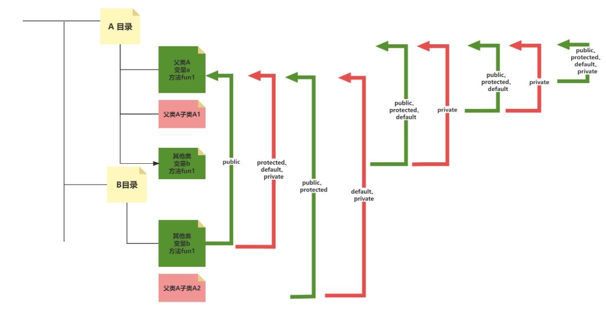
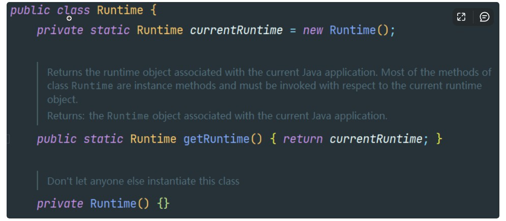

#### 基本数据类型

整数类型：byte、short、int、long

浮点类型：float、double

字符类型：char

布尔类型：boolean

|     类型     | 占用存储空间 |        表数范围         |                           | 默认值 |
| :----------: | :----------: | :---------------------: | ------------------------- | ------ |
|     byte     |    1字节     | -128~127（-2^7 ~ 2^7-1) |                           | 0      |
|    short     |    2字节     |     -2^15 ~ 2^15-1      |                           | 0      |
|     int      |    4字节     |     -2^31 ~ 2^31-1      |                           | 0      |
|     long     |    8字节     |     -2^63 ~ 2^36-1      |                           | 0      |
| 单精度float  |    4字节     |  -3.403e38 ~ 3.403e38   | 尾数可以精确到7位有效数字 | 0.0f   |
| 双精度double |    8字节     | -1.798e308 ~ 1.798e308  | 浮点型常量默认类型        | 0.0    |
|     char     |    2字节     |                         |                           | \u0000 |
|   boolean    |     1位      |                         |                           | false  |

#### 基本数据类型变量间运算规则


#### 修饰符

##### 访问修饰符

访问修饰符用于控制Java类、Java接口或类中的成员变量和方法的访问权限，可以分为public、protected、private和默认(即不加任何修饰符)四种类型

| 访问级别 | 访问控制修饰符 | 同类 |  同包  | 子类(不同包) | 不同包(其他类) |
| :------: | :------------: | :--: | :----: | :----------: | :------------: |
|   公共   |     public     | 允许 |  允许  |     允许     |      允许      |
|  受保护  |   protected    | 允许 |  允许  |     允许     |     不允许     |
|   默认   |   缺省修饰符   | 允许 |  允许  |    不允许    |     不允许     |
|   私有   |    private     | 允许 | 不允许 |    不允许    |     不允许     |



##### 非访问修饰符

- **final**：

  final修饰符可以用于Java类、Java方法和Java变量中，表示该类、方法或变量只能`被赋值一次`。

  在声明final`变量`时必须要`赋初值`，而final`方法`表示该方法`不可以被子类重写`，final类代表该`类不可以被继承`。

- **static**:

  static修饰符可以用于Java类、Java变量和Java方法中，表示该类、变量或方法属于`类而非实例化对象`，多个实例的`静态成员变量`可以`共享`。而`静态方法`可以`直接调用`，无需实例化对象，使用类名.方法名的方式即可调用。

- **abstract**:

  abstract修饰符可以用于Java类、Java方法中，表示该类或方法`只是一个声明而没有实现`。

  一旦Java类使用abstract修饰符，则该类就必须被声明为抽象类(abstract class)。而抽象方法必须被声明在抽象类中，子类必须实现父类的所有抽象方法。

- **synchronized**:

  synchronized修饰符可以用于Java方法中，表示该方法只能在`一个线程中执行`。当一个线程正在访问synchronized方法时，其他线程必须等待该线程执行完成后才能继续执行该方法。

##### 其他非访问修饰符

- **volatile**：

  volatile修饰符可以用于Java变量中，可以确保`多个线程`之间变量值的`可见性`。

  当多个线程同时访问同一个volatile变量时，它们会从`内存`中读取该变量的值，而不是从线程的`本地缓存`中读取。同样的，当`更新`一个volatile变量时，它会`立即写入到内存`中，而`不是延迟更新`。

- transient：

  transient修饰符可以用于Java变量中，表示该变量不参与Java序列化。当Java对象被序列化时，transient变量的值将被忽略。

- native：

  native修饰符可以用于Java方法中，表示该方法是使用`其他编程语言`编写的库函数。只有声明有native修饰符的方法才可以使用Java调用其他语言编写的方法。

- strictfp:

  strictfp修饰符可以用于Java方法中或Java类声明中，表示该方法或类的浮点运算采用IEEE 754规范。

#### 哈希表的工作原理

##### 1. 概述（数据结构）

   哈希表中，数据通过`哈希函数`计算得到的哈希值来进行存储和查询。哈希函数将数据映射到哈希表中的一个位置，该位置称为`哈希桶`，每个哈希桶可以存储一个或多个数据元素。

##### 2. 工作步骤(哈希函数计算+哈希冲突的处理)

   1. 存储元素通过**哈希函数**计算得到的哈希值将作为该元素在哈希表中的存储位置。

   2. 不同的数据元素可能会计算得到相同的哈希值，导致**哈希冲突**。

   3. 哈希冲突的处理

      **开放寻址法和链表法**

      - **开放寻址法**：哈希表中不采用链表来处理冲突，而是在发生冲突时继续寻找未被占用的哈希槽，直到找到一个可用的位置将数据插入。寻找的方法包括：线性探测、平方探测、双重探测

        ```python
        //使用线性探测的方式进行开放寻址法
        //htable为哈希表，key为关键字，dat为数据，size为哈希表大小
        bool insert(Hash htable, KeyType key, DataType dat, int size){
            int hash = h(key, size);   //获取关键字的哈希值
            int pos = hash; 
            int i = 1;     //探测的步数
            while(htable[pos].key != NULL && htable[pos].key != key){  //遇到冲突时
                pos = (hash+i)%size;   //计算下一个位置
                i++;
            }
            if(htable[pos].key == key)  //如果已经存在相同关键字的数据
                return false;
            htable[pos].key = key;  //插入数据
            htable[pos].data = dat;
            return true;
        }
        ```

        

      - **链表法**是指在哈希表的每个桶中维护一个链表，相同哈希值的数据元素会被存储在同一个链表中。

      - 二者区别：

        - 链表法是在哈希表中每个位置上维护一个链表，将哈希冲突的数据插入相应位置的链表中。
        - 开放寻址法则是直接在哈希表中寻找可用的位置。

        所以，开放寻址法：

        - 使用的空间更小，因为不需要为链表维护额外的指针空间
        - 在缓存中的命中率更高，因为数据在哈希表中是连续存储的
        - 查找的时间更短，因为不需要遍历链表而是直接计算得到数据的位置
      4. 元素查找
      	首先，哈希函数会对要查找的数据元素进行计算，得到一个哈希值。然后，通过这个哈希值可以直接定位到哈希表中的对应桶，再在桶中进行线性查找（开放连表法使用的探测方式）或链表查找，直到找到目标数据元素或者确定目标数据元素不存在。

#### 排序算法

| 算法 | 平均时间复杂度 | 最好情况 | 最坏情况 | 空间复杂度 | 稳定排序 | 额外存储空间 |
| :--: | :----------: | ---- | ---- | :------: | :--------: | :------: |
| 选择排序 | O(n2) | O(n2) | O(n2) | O(1) | 非稳定 | 原地 |
| 冒泡排序 | O(n2) | O(n) | O(n2) | O(1) | 稳定 | 原地 |
| 插入排序 | O(n2) | O(n) | O(n2) | O(1) | 稳定 | 原地 |
| 希尔排序 | O(n1.3) | O(nlogn) | O(n2) | O(1) | 稳定 | 原地 |
| 归并排序 | O(nlogn) | O(nlogn) | O(nlogn) | O(n) | 稳定 | 非原地 |
| 快速排序 | O(nlogn) | O(nlogn) | O(n2) | O(logn) | 非稳定 | 原地 |
| 堆排序 | O(nlogn) | O(nlogn) | O(nlogn) | O(1) | 非稳定 | 原地 |
| 计数排序 | O(n+k) | O(n+k) | O(n+k) | O(n+k) | 稳定 | 非原地 |
| 桶排序 | O(n+k) | O(n+k) | O(n2) | O(n+k) | 稳定 | 非原地 |
| 基数排序 | O(kn) | O(kn) | O(kn) | O(n+k) | 稳定 | 非原地 |

不稳定：交换不相邻的元素，从而可能改变相同元素的相对位置

对于序列[5,2,5,1,3]，第一次选择排序将第一个5和1交换，导致两个5的顺序颠倒

##### 1. 选择排序
- 概述：每次在无序区中找到最小值放在有序区  （最小值与有序区的当前index元素进行交换）

- 时间复杂度：

  对n个元素，需要进行n*(n-1)/2次比较和交换：

  ```
  n=3, 需要进行2+1次比较，即((n-1)+1)*(n-1)/2
  最好最坏情况均一致
  ```

- 代码：

```java
public static int[] selectionSort(int[] arr){
        int length = arr.length;
        int leftIndex = 0;
        int rightIndex = 0;
        while(leftIndex < length-1){
            int min = arr[leftIndex];
            for(int j=leftIndex+1; j<=length-1; j++){
                if(arr[j] <= min){
                    min = arr[j];
                    rightIndex = j;    //找到最小值
                }
            }
            arr[rightIndex] = arr[leftIndex];  // 进行交换
            arr[leftIndex] = min;
            leftIndex++;

            System.out.println("第"+(leftIndex)+" 趟"+Arrays.toString(arr));
        }

        return arr;
    }
```

##### 2. 冒泡排序

- 概述：

```xml
1.比较相邻的元素。如果第一个比第二个大，就交换它们两个；
2.对每一对相邻元素作同样的工作，从开始第一对到结尾的最后一对，这样在最后的元素应该会是最大的数；
3.针对所有的元素重复以上的步骤，除了最后一个；
重复步骤1~3，直到排序完成。
```
- 时间复杂度：

```
最好情况：
	如果输入的数据已经是有序的，那么冒泡排序只需要进行一趟比较，没有任何元素交换。此时，比较次数为n-1，交	换次数为0，所以时间复杂度为O(n)。
最坏情况：
	如果输入的数据是逆序的，那么冒泡排序需要进行n-1趟比较，每趟都要进行n-i次比较和交换，其中i为当前的趟	数。此时，比较次数为(n-1)+(n-2)+…+1=n(n-1)/2，交换次数与比较次数相同，所以时间复杂度为O(n^2)。
平均情况：
	如果输入的数据是随机的，那么冒泡排序的平均时间复杂度可以通过概率分析得到。假设任意两个元素相等的概率为		p，那么不相等的概率为1-p，需要交换的概率为(1-p)/2。那么，平均比较次数为n(n-1)/2，平均交换次数为		n(n-1)(1-p)/4，所以时间复杂度仍然为O(n^2)
```

- 空间复杂度：
``` 
冒泡排序只需要一个临时变量来进行元素交换，所以空间复杂度为O(1)，即为常数级别。
```


- 代码：
```java
public static int[] bubbleSort(int[] arr){
    int length = arr.length;
    for(int i=0; i<length-1; i++){
        for(int j=0; j<length-i-1; j++){
            if(arr[j] > arr[j+1]){
                int temp = arr[j+1];
                arr[j+1] = arr[j];
                arr[j] = temp;
            }
        }
        System.out.println("第"+(i+1)+" 趟"+Arrays.toString(arr));
    }
    return arr;
}
```

##### 3. 插入排序

- 概述：
```
构建有序序列，对于未排序数据，在已排序序列中从后向前扫描，找到相应位置并插入。比较过的元素依次向后挪
（也是通过与相邻元素进行比较，所以稳定）
```

```
表现不错情况：
 1. 当待排序的原序列中大多数元素都已有序的情况下，此时进行的元素比较和移动的次数较少；
 2. 当原序列的长度很小时，即便它的所有元素都是无序的，此时进行的元素比较和移动的次数还是很少。
```

- 时间复杂度：
``` 
最好情况：
	如果输入的数据已经是有序的，那么插入排序只需要进行一趟比较，没有任何元素交换。此时，比较次数为n-1，交	换次数为0，所以时间复杂度为O(n)。
最坏情况：
	如果输入的数据是逆序的，那么插入排序需要进行n-1趟比较，每趟都要进行n-i次比较和交换，其中i为当前的趟	数。此时，比较次数为(n-1)+(n-2)+…+1=n(n-1)/2，交换次数与比较次数相同，所以时间复杂度为O(n^2)。
平均情况：
	假设任意两个元素相等的概率为p，那么不相等的概率为1-p，需要交换的概率为(1-p)/2。那么，平均比较次数为		n(n-1)/2，平均交换次数为n(n-1)(1-p)/4，所以时间复杂度仍然为O(n^2)。
```

- 空间复杂度
```
插入排序只需要一个临时变量来进行元素交换，所以空间复杂度为O(1)，即为常数级别。
```

- 代码：
```java
    public static Integer[] insertionSort(Integer[] arr){
        int length = arr.length;
        for(int i=1; i<length; i++){
            int temp = arr[i];
            int currentIndex = i;
            for(int j=i-1; j>=0; j--){
                if(temp < arr[j]){
                    arr[currentIndex] = arr[j];  //比较过的元素向后挪
                    currentIndex--;
                }else{
                    arr[currentIndex] = temp;
                    break;
                }
            }
            arr[currentIndex] = temp;
//            System.out.println(i+" round"+ Arrays.toString(arr));
        }
        return arr;
    }
```

##### 4. 希尔排序（递减增量排序）

```
根据插入排序表现不错的情况，将序列根据（不断递减至1）增量分为多个子串，每一趟都将前一趟得到的整个序列划分为不同的子序列，并再次对这些子序列进行直接插入排序直到增量为1，则表示对整个序列进行排序
```

```java
public static int[] shellSort(int[] arr){
    int length = arr.length;
    for(int gap = (int)Math.floor((length / 2)); gap > 0; gap = (int)Math.floor(gap / 2)){  //每次递减增量直到1
        for(int i = gap; i < length; i++){
            int j = i;
            int current = arr[j];
            while(j-gap >=0 && current < arr[j-gap]){ //对子序列进行插入排序
                arr[j] = arr[j-gap];
                j = j -gap;
            }
            arr[j] = current;
    }
        System.out.println(Arrays.toString(arr));
}
    return arr;
}
```

##### 5. 归并排序（分治法）

- 概述
```
将已有序的子序列合并，得到完全有序的序列；即先使每个子序列有序，再使子序列段间有序。
*                  若将两个有序表合并成一个有序表，称为2-路归并。

 1.把长度为n的输入序列分成两个长度为n/2的子序列；
 2.对这两个子序列分别采用归并排序；
 3.将两个排序好的子序列合并成一个最终的排序序列
 （分别从两个子序列中选择元素存储到额外的有序表中）
```


- 时间复杂度

```
归并排序的时间复杂度主要取决于比较和合并的次数，而不是数据的有序程度。无论数据如何分布，归并排序都要将数据分成logn层，每层都要进行n次比较和合并。所以时间复杂度为O(nlogn)。
```

- 空间复杂度

```
一般来说，归并排序需要一个临时数组来存放合并后的数据，所以空间复杂度为O(n)，即为线性级别。
```

- 代码

```java
public static Integer[] mergeSort(Integer[] arr){
    int length = arr.length;
    if(length < 2){
        return arr;
    }
    int middle = (int)Math.floor(length / 2);
    Integer[] leftArr = Arrays.copyOfRange(arr, 0,middle);
    Integer[] rightArr = Arrays.copyOfRange(arr, middle, length);  // 不断拆分子序列

    return merge(mergeSort(leftArr), mergeSort((rightArr)));

}

public static Integer[] merge(Integer[] left, Integer[] right){  //对子序列进行排序
    ArrayList<Integer> result = new ArrayList<>();
    ArrayList<Integer> leftList = new ArrayList<>(Arrays.asList(left));
    ArrayList<Integer> rightList = new ArrayList<>(Arrays.asList(right));

    while(!leftList.isEmpty() && !rightList.isEmpty()){
        if(leftList.get(0) < rightList.get(0)){  //  从两个子序列中选择元素存储到额外的有序表中
            result.add(leftList.remove(0));
        }else {
            result.add((rightList.remove(0)));
        }
    }
    while(!leftList.isEmpty()){
        result.add(leftList.remove(0));
    }
    while(!rightList.isEmpty()){
        result.add(rightList.remove(0));
    }
    System.out.println(result.toString());
    return result.toArray(new Integer[result.size()]);
}
```

##### 6. 快速排序

- 概述

```
* 1.找一个基准值，用两个指针分别指向数组的头部和尾部；
* 2.先从尾部向头部开始搜索一个比基准值小或等于的元素，搜索到即停止，并记录指针的位置；
* 3.再从头部向尾部开始搜索一个比基准值大或等于的元素，搜索到即停止，并记录指针的位置；
* 4.交换当前左边指针位置和右边指针位置的元素；
* 5.重复2,3,4步骤，直到左边指针的值大于右边指针的值停止。

使得基准值左边元素均小于基准值，右边均大于基准值
```

- 时间复杂度(取决于划分的效果)：

```
最好情况：
	如果每次划分都能将序列平均分成两部分，那么快速排序需要递归logn层，每层的时间复杂度为O(n)，所以快速排	序的时间复杂度为O(nlogn)
最坏情况：
	如果每次划分都将序列分成了一部分为空，另一部分为n-1个元素，那么快速排序需要递归n层，每层的时间复杂度为	O(n)，快速排序的时间复杂度为O(n^2)
平均情况：
	O(nlogn)
```

- 空间复杂度：

```
快速排序递归的每层需要一个额外的空间来存储基准元素
最好情况下，需要递归logn层，那么此时空间复杂度为O(logn)
最坏情况下，需要递归n层，那么此时空间复杂度为O(n)
平均情况下，空间复杂度为O(logn)
```

- 代码：

```java
public static void quickSort(int[] arr, int startIndex, int endIndex){
    //递归结束
    if(startIndex >= endIndex){
        return;
    }
    //找到基准元素位置
    int pivotIndex = partion(arr, startIndex, endIndex);
    quickSort(arr, startIndex, pivotIndex-1);
    quickSort(arr, pivotIndex+1, endIndex);
}

public static int partion(int[] arr, int startIndex, int endIndex){
    //默认第一个为基准值
    int pivot = arr[startIndex];
    int index = startIndex;//记录指针位置
    int left = startIndex;
    int right = endIndex+1;
    while(true){
        //左指针找到比pivot大的
        while(arr[++left] <= pivot){
            if(left >= endIndex){
                break;
            }
        }
        //右指针找到比pivot小的
        while(arr[--right] >= pivot){
            if(right <= startIndex){
                break;
            }
        }
        if(left >= right){
            break;
        }
        // 左右指针元素交换
        int temp = arr[left];
        arr[left] = arr[right];
        arr[right] = temp;
    }
    //基准（【0】）与right指针的值交换
    arr[startIndex] = arr[right];
    arr[right] = pivot;
    
    return right;
}
```

##### 7. 堆排序

- 顶堆

  ```
  * 每个结点的值都大于或等于其左右孩子结点的值，称为大顶堆；
  * 或者每个结点的值都小于或等于其左右孩子结点的值，称为小顶堆
  ```

升序采用大顶堆，降序采用小顶堆

- 概述：

```
1.构建大顶项
2.将堆顶元素与末尾元素进行交换，使末尾元素最大。
3.然后继续调整堆（使堆顶元素最大），再将堆顶元素与末尾元素交换，得到第二大元素。如此反复进行交换、重建、交换。
```

- 时间复杂度：

```
  进行堆排序，都需要进行一次建堆+n-1次调整，每次调整的时间复杂度为O(logn)，故堆排序的时间复杂度为O(nlogn)
```

- 空间复杂度：

```
堆排序只需要一个临时变量来进行元素交换，所以空间复杂度为O(1)，即为常数级别。
```

- 代码：

```java
public static int[] heapSort(int[] arr){

    int length = arr.length;
    // 构建大顶项
    // length/2 -1 为最后一个非叶子节点
    for(int i= length/2 -1; i >=0; i--){
        adjustHeap(arr, i, length);
    }

    // 交换首位节点 + 调整堆结构
    for(int j = length-1; j>0; j--){
        swap(arr, 0, j);
        adjustHeap(arr, 0, j);    
        //选出最大元素节点 至首位    
        //adjustHeap(arr, j/2-1,j)由于第一次已经排好序了，所以前面的循环是重复无意义的，不如直接从0开始比较第一二层
    }
    return arr;
}

public static void adjustHeap(int[] arr, int index, int length){
    int temp = arr[index];
    for(int k = 2*index+1; k <length; k=k*2+1){//从i结点的左子结点开始，也就是2i+1处开始
        if(arr[k+1] > arr[k] && k+1 < length){//如果左子结点小于右子结点，k指向右子结点
            k++;
        }
        if(arr[k] > temp){
            arr[index] = arr[k];
            index = k;  // 找到temp合适的位置
        }else {
            break;
        }
    }
    arr[index] = temp;
}
public static void swap(int[] arr, int j, int k){
    int temp = arr[j];
    arr[j] = arr[k];
    arr[k] = temp;
}
```

##### 8. 计数排序

- 概述：

```
1.找出待排序的数组中最大和最小的元素；
2.统计数组中每个值为i的元素出现的次数，存入数组C的第i项；
3.对所有的计数累加（从C中的第一个元素开始，每一项和前一项相加）；
4.反向填充目标数组：将每个元素i放在新数组的第C(i)项，每放一个元素就将C(i)减去1
```

- 时间复杂度：

```
计数排序只需要进行一次遍历和一次输出，没有任何元素交换。此时，时间复杂度为O(n + k)，其中n是数据的个数，k是数据的取值范围。(对n个数据进行遍历，填入到频数数组中，然后对范围为k的频数数组进行遍历输出，得到排序结果)
```

- 空间复杂度：

```
计数排序需要一个临时数组来存放数据的频数和位置，所以空间复杂度为O(n + k)，其中n是数据的个数，k是数据的取值范围。
```

- 代码：

```java
public static int[] countSort(int[] arr){
    int max = arr[0];
    int length = arr.length;
    for(int i=0; i<length;i++){
        if(arr[i] > max){
            max = arr[i];
        }
    }

    int[] countArray = new int[max+1];
    Arrays.fill(countArray,0);
    for (int i = 0; i < length; i++) {
        countArray[arr[i]] ++;
    }
    int sortedIndex = 0;
    for (int i = 0; i < countArray.length; i++) {
        int count = countArray[i];
        while(count-- > 0){
            arr[sortedIndex++] = i;
        }
    }
    return arr;
}
```

##### 9. 桶排序

- 概述：

```
* 设置一个定量的数组当作空桶； （每个桶对应收纳一定范围的数据）
* 遍历输入数据，并且把数据一个一个放到对应的桶里去；
* 对每个不是空的桶进行排序；  （使用其他排序算法）
* 从不是空的桶里把排好序的数据拼接起来。
```

- 时间复杂度：

```
桶排序需要进行一次遍历和一次输出,n为数据个数，k为桶个数。
对n个数据进行遍历，填充到桶中，进行排序O(?)，最后遍历k个桶，输出排序数据O(k)，所以时间复杂度为O(n+k)

如果要排序的数据有n个，我们把它们分在m个桶中，这样每个桶里的数据就是k = n / m，桶内使用快速排序。每个桶内排序的时间复杂度就为O(k*logk)。m个桶就是m * O(k * logk)=m * O((n / m)*log(n / m))=O(nlog(n / m))。当桶的个数m接近数据个数n时，log（n/m）就是一个较小的常数，所以时间复杂度接近O(n)。

桶排序的应用场景十分严苛，数据应该分布比较均匀
```

- 空间复杂度：

```
桶排序需要一个k个桶来存放数据，所以空间复杂度为O(n + k)，其中n是数据的个数，k是桶的个数。
```

- 代码：

```java
public static int[] bucketSort(int[] arr){
    int length = arr.length;
    //确定最大、最小值
    int minValue = arr[0];
    int maxValue = arr[0];
    for (int i = 0; i < length; i++) {
        if(arr[i] < minValue){
            minValue = arr[i];
        }
        if(arr[i] > maxValue){
            maxValue = arr[i];
        }
    }

    // 确认桶的数量和容纳范围
    int defaultSize = 5;  //桶的容量
    int bucketNUm = (int)Math.floor((maxValue - minValue) / defaultSize)+1;   // 桶的数量
    List<List<Integer>> bucketArray = new ArrayList<>(bucketNUm);
    for (int i = 0; i < bucketNUm; i++) {
        bucketArray.add(new ArrayList<>());
    }
    for (int n : arr) {
        int idx = (n - minValue) * bucketNUm/ (maxValue - minValue +1); // 属于哪个桶
        bucketArray.get(idx).add(n);
    }
    // 对每个桶进行排序
    int idx2 = 0;
    for (List<Integer> bucket: bucketArray){
        System.out.println(bucket.toString());
        Integer[] result = insertionSort(bucket.toArray(new Integer[bucket.size()]));
        for(Integer resultNum : result){
            arr[idx2++] = resultNum;
        }
    }
    return arr;
}
```

##### 10. 基数排序

- 概述：

```
* 10个桶， 分别保存余数0-9的元素
* 按照个位大小入桶，然后桶中由小到大组成新的序列
* 对新序列按照百位大小入桶，依次循环至最大位数
*
* 位数n到个位组成的数字  小的会排在前面  达到升序的目的
```

- 时间复杂度：

```
基数排序的时间复杂度取决于元素的位数和进制数，一般可以表示为O(d*(n+b))，其中d是元素的最大位数，n是元素的个数，b是元素的进制数。例如，如果元素是十进制的四位数，那么d=4，b=10，时间复杂度为O(4*(n+10))。
```

- 空间复杂度：

```
基数排序的空间复杂度也取决于元素的位数和进制数，一般为O(n+b)，因为需要一个临时数组来存放排序后的元素，以及一个计数数组来记录每个桶中的元素个数。
```

- 代码：

```java
public static int[] radixSort(int[] arr, int d){
    int k = 0;
    int m = 1;
    int[][] temp = new int[10][arr.length];
    int[] num = new int[10];
    Arrays.fill(num, 0);

    while(m <= d){
        for (int item:arr){
            int idx = item / (int)Math.pow(10, m-1) % 10; // 获取对应位的余数
            temp[idx][num[idx]] = item;
            num[idx]++;
        }

        //将存储下来的按余数顺序排序出来
        for (int i = 0; i < 10; i++) {
            for (int j = 0; j < num[i]; j++) {
                arr[k++] = temp[i][j];
            }
        }
        k = 0;
        m++;
        Arrays.fill(num,0);
    }
    return arr;
}
```


#### 设计模式

##### 1. 单例模式

- 概述

所谓类的单例设计模式，就是采取一定的方法保证在整个的软件系统中，对某个类只能存在 `一个对象实例`，并且该类`只提供一个取得其对象实例的方法`（静态方法）

- 八种方式
  - 饿汉式（静态常量）
  - 饿汉式（静态代码块）
  - 懒汉式（线程不安全）
  - 懒汉式（线程安全，同步方法）
  - 懒汉式（线程不安全，同步代码块）
  - 双重检查
  - 静态内部类
  - 枚举

###### 1.饿汉式（静态常量）

- 概述

  1. 构造器私有化（防止外部 new）

  2. 类的内部创建对象

  3. 向外暴露一个静态的公共方法 `getInstance`

- 代码

```java
public class Singleton(){
    private Singleton(){}
    private static final Singleton instance = new Singleton();
    
    public static Singleton getInstance(){
        return instance;
    }
}
```

- 优缺点

  - 优点：这种写法比较简单，就是在类装载的时候就完成实例化。避免了线程同步问题

  - 缺点：在类装载的时候就完成实例化，`没有达到 Lazy Loading` 的效果。如果从始至终从未使用过这个实例，则会造成内存的浪费

  - 这种方式基于 classloader 机制避免了多线程的同步问题。不过，instance 在类装载时就实例化，在单例模式中大多数都是调用`getlnstance` 方法，但是导致类装载的原因有很多种，因此不能确定有其他的方式（或者其他的静态方法）导致类装载，这时候初始化 instance 就没有达到 Lazy loading 的效果

  - 结论：这种单例模式可用，可能造成`内存浪费`

###### 2.饿汉式（静态代码块）

- 概述
  1. 构造器私有化
  2. 类的内部声明对象
  3. 在静态代码块中创建对象
  4. 向外暴露一个静态的公共方法

- 代码

```java
public class Singleton{
    // 1、构造器私有化
    private Singleton(){}
    
    // 2、类的内部声明对象
    private static Singletion instance;
    
    // 3、在静态代码块中创建对象
    static {
        instance = new Singleton();
    }
    
    // 4、向外暴露一个静态的公共方法
    public static Singleton getInstance(){
        return instance;
    }
}
```


- 优缺点
  - 这种方式和上面的方式其实类似，只不过将类实例化的过程放在了静态代码块中，也是在类装载的时候，就执行静态代码块中的代码，初始化类的实例。优缺点和上面是一样的。
  - 结论：这种单例模式可用，但是可能造成内存浪费

###### 3.懒汉式（线程不安全）

- 概述
  1. 构造器私有化
  2. 类的内部声明对象
  3. 向外暴露一个静态的公共方法，当使用到该方法时，才去创建 instance

- 代码

```java
public class Singleton{
    // 1、构造器私有化
    private Singleton(){}
    
    // 2、类的内部声明对象
    private static Singletion instance;
    
    // 3. 向外暴露一个静态的公共方法，当使用到该方法时，才去创建 instance
    public static Singleton getInstance(){
        if(instance == null){
            instance = new Singletion();
        }
        return instance;
    }
}
```


- 优缺点
  - 起到了 Lazy Loading 的效果，但是只能在`单线程`下使用
  - 如果在多线程下，一个线程进入了判断语句块，还未来得及往下执行，另一个线程也通过了这个判断语句，这时便会`产生多个实例`
  - 结论：在实际开发中，不要使用这种方式

###### 4.懒汉式（线程安全，同步方法）

- 概述
  1. 构造器私有化
  2. 类的内部声明对象
  3. 向外暴露一个静态的公共方法，加入同步处理的代码，解决线程安全问题

- 代码

```java
public class Singleton{
    // 1、构造器私有化
    private Singleton(){}
    
    // 2、类的内部声明对象
    private static Singletion instance;
    
    // 3. 向外暴露一个静态的公共方法，加入同步处理的代码，解决线程安全问题
    public static synchronized Singleton getInstance(){
        return instance;
    }
}
```

- 优缺点
  - `解决了线程不安全问题`
  - `效率太低`了，每个线程在想获得类的实例时候，执行`getlnstance()`方法都要进行同步。而其实这个方法只执行一次实例化代码就够了，后面的想获得该类实例，直接return就行了。后续仍需对方法进行同步效率太低。（粒度太大了）
  - 结论：在实际开发中，不推荐使用这种方式

###### 5.懒汉式（线程不安全，同步代码块）

- 概述
  1. 构造器私有化
  2. 类的内部声明对象
  3. 向外暴露一个静态的公共方法，加入同步处理的代码块

- 代码

```java
public class Singleton{
    // 1、构造器私有化
    private Singleton(){}
    
    // 2、类的内部声明对象
    private static Singletion instance;
    
    // 3、向外暴露一个静态的公共方法，加入同步处理的代码块
    publiv static Singleton getInstance(){
        if(instance == null){
            synchronized (Singleton.class) {
                instance = new Singleton();
            }
        }
        return instance;
    }      
}
```


- 优缺点
  - 这种方式，本意是想对第四种实现方式的改进，因为前面同步方法效率太低，改为同步产生实例化的的代码块
  - 但是这种同步并不能起到线程同步的作用。跟第3种实现方式遇到的情形一致，假如一个线程进入了判断语句块，还未来得及往下执行，另一个线程也通过了这个判断语句，这时便会产生多个实例
  - 结论：在实际开发中，不能使用这种方式

###### 6.双重检查（推荐）

- 概述
  1. 构造器私有化
  2. 类的内部创建对象，同时用volatile关键字修饰修饰
  3. 向外暴露一个静态的公共方法，加入同步处理的代码块，并进行双重判断，解决线程安全问题

- 代码

```java
public class Singleton{
    // 1、构造器私有化
    private Singleton(){}
    
    // 2、类的内部声明对象，同时用volatile关键字修饰修饰
    private static volatile Singletion instance;  
    
    //3.向外暴露一个静态的公共方法，加入同步处理的代码块，并进行双重判断，解决线程安全问题
    publiv static Singleton getInstance(){
        if(instance == null){
            synchronized (Singleton.class){
                if(instance == null){
                    instance = new Singleton();
                }
            }
        }
        return instance;
    }
}
```

volatile关键字：当多个线程同时访问同一个volatile变量时，它们会从`内存`中读取该变量的值，而不是从线程的`本地缓存`中读取。同样的，当`更新`一个volatile变量时，它会`立即写入到内存`中，而`不是延迟更新`。

确保了多个线程都加入了第一个判断，在第一个线程实例化后，其他线程不再从本地缓存中读取null的instance，而是实例化的instance，不再加入第二个判断。

- 优缺点

  - Double-Check 概念是多线程开发中常使用到的，我们进行了两次检查，这样就可以保证线程安全了

  - 这样实例化代码只用执行一次，后面再次访问时直接 return 实例化对象，也避免的反复进行方法同步

  - `线程安全；延迟加载；效率较高`

  - 结论：在实际开发中，推荐使用这种单例设计模式

###### 7.静态内部类(推荐)

- 概述
  1. 构造器私有化
  2. 定义一个静态内部类，内部定义当前类的静态属性
  3. 向外暴露一个静态的公共方法

- 代码

```java
public class Singleton{
    // 1、构造器私有化
    private Singleton(){}
    
    // 2、定义一个静态内部类，内部定义当前类的静态属性
    private static class SingletonInstance(){
        private static final Singleton instance = new Singleton();
    }
    
    // 3、向外暴露一个静态的公共方法
    publiv static Singleton getInstance(){
        return SingletonInstance.instance;
    }
}
```

- 优缺点

  - 这种方式采用了类装载的机制，来保证初始化实例时只有一个线程

  - 静态内部类方式在 Singleton 类被装载时并不会立即实例化，而是在需要实例化时，调用`getlnstance`方法，才会装载Singletonlnstance 类，从而完成 Singleton 的实例化

  - 类的静态属性只会在第一次加载类的时候初始化，JVM帮助我们保证了线程的安全性，在类进行初始化时，别的线程是无法进入的

  - 优点：避免了线程不安全，利用静态内部类特点实现延迟加载，效率高

  - 结论：推荐使用

###### 8.枚举

- 代码

```java
public enum Singleton {
    INSTANCE;

    public void sayHello() {
        System.out.println("Hello World");
    }
}
```

- 优缺点

  - 这借助 JDK1.5 中添加的枚举来实现单例模式。不仅能避免多线程同步问题，而且还能防止反序列化重新创建新的对象

  - 这种方式是 Effective Java 作者 Josh Bloch 提倡的方式

  - 结论：推荐使用

###### JDK源码分析

JDK中 java.lang.Runtime 就是经典的单例模式



###### 注意事项

● 单例模式保证了系统内存中该类`只存在一个对象`，`节省了系统资源`，对于一些需要`频繁创建销毁`的对象，使用单例模式可以`提高系统性能`
● 当想实例化一个单例类的时候，必须要记住使用相应的`获取对象的方法`，而不是使用 new
● 单例模式使用的场景：需要`频繁的进行创建和销毁的对象`、`创建对象时耗时过多或耗费资源过多但又经常用到的对象`（即：重量级对象）、`工具类对象`、`频繁访问数据库或文件的对象`（比如数据源、session 工厂等）			